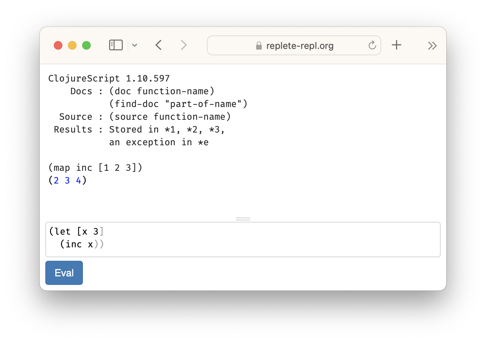
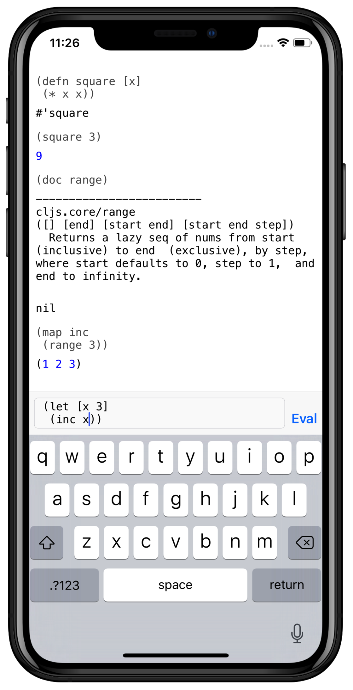

# Replete REPL

Replete REPL is a ClojureScript REPL for iOS, macOS, Android, and the web.

Read the [Replete REPL User Guide](guide.html) or browse the [Replete REPL SDK](sdk.html).

Replete REPL is free and [open source](https://github.com/replete-repl/).

<main style="max-width: 800px; margin: 5px auto 0; display:flex; align-items: flex-start; justify-content:center; flex:1; flex-wrap: wrap">

</main>
